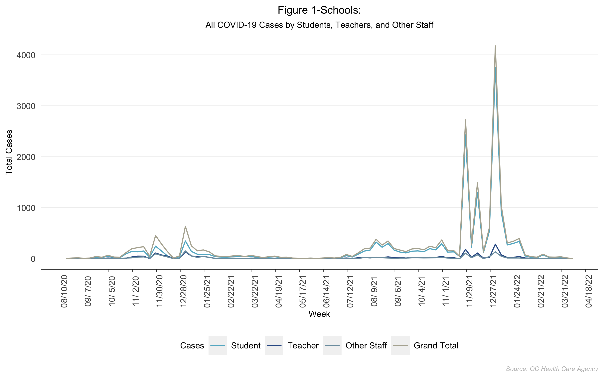
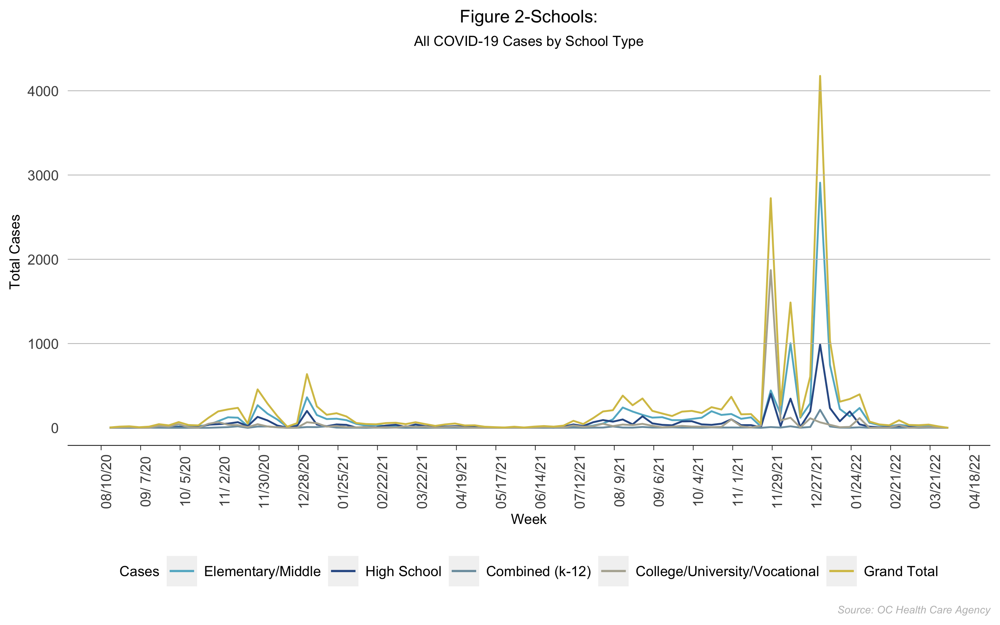
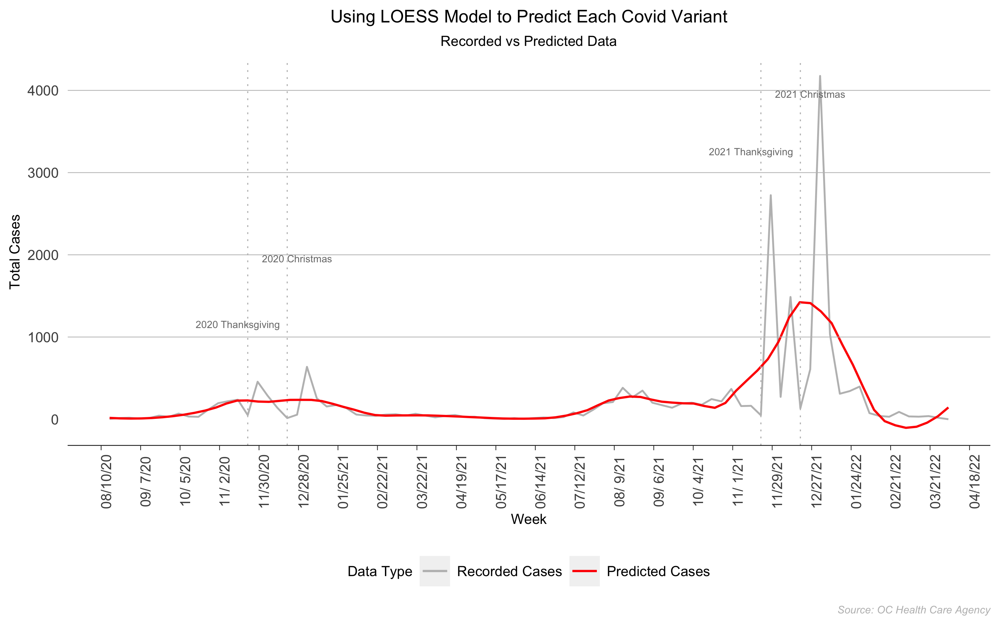
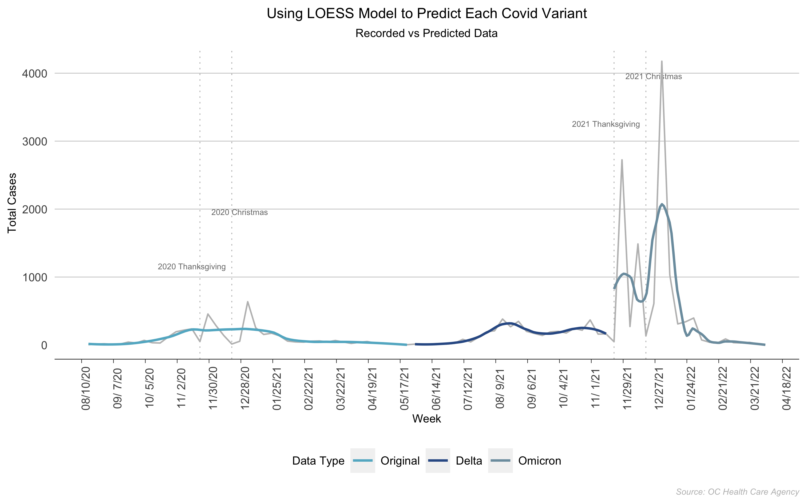

<h1>Web Scrapping: Why Were Covid Cases Lower During Holidays in Orange County?</h1>

Author: Nicole Golden  Date: April 20, 2022 

This data visualization project is inspired by my machine learning class. The question is that we observe low cases during Thanksgiving and Christmas in Orange County, CA. First, I try to visualize raw data. Then, after showing this "paradox," I use the <a href="https://en.wikipedia.org/wiki/Local_regression" target=_blank>loess model</a> to make some smoothness predictions.
  
(You can find the data and code on my <a href="https://github.com/NicoleGolden/OC_covid_project/" target=_blank>GitHub</a> page.)
  
The data comes from <a href="https://occovid19.ochealthinfo.com/coronavirus-in-oc" target=_blank>OC Health Care Agency</a> Table 1 and Table 2. To collect the data, I used the web scrapping technique using R. The period covers from 2020-08-16 to 2022-04-09.
  
After some basic data cleaning, I can visualize the raw data for each table.

<h6>Figure 1 (Image Source: Nicole Golden. Data Source: <a href="https://occovid19.ochealthinfo.com/coronavirus-in-oc" target=_blank>OC Health Care Agency</a></h6>

<h6>Figure 2 (Image Source: Nicole Golden. Data Source: <a href="https://occovid19.ochealthinfo.com/coronavirus-in-oc" target=_blank>OC Health Care Agency</a></h6>

The plots above show that covid cases during Thanksgiving and Christmas were very low. They were lower because people traveled to other areas to spend holidays. We can use the loess model to make some smooth predictions.
  
ggplot2 package from R provides plot using loess model. I used two methods to plot recorded vs. predicted cases:
(i) Plot recorded cases against predicted cases;
(ii) Plot recorded cases against three separate waves: the original wave, the delta wave, and the omicron wave.

<h6>Figure 3 (Image Source: Nicole Golden. Data Source: <a href="https://occovid19.ochealthinfo.com/coronavirus-in-oc" target=_blank>OC Health Care Agency</a></h6>

<h6>Figure 4 (Image Source: Nicole Golden. Data Source:  <a href="https://occovid19.ochealthinfo.com/coronavirus-in-oc" target=_blank>OC Health Care Agency</a></h6>

Figure 3 and Figure 4 are the plots for raw data vs. predicted data. Now we can see that the covid cases during holidays are higher than recorded.

